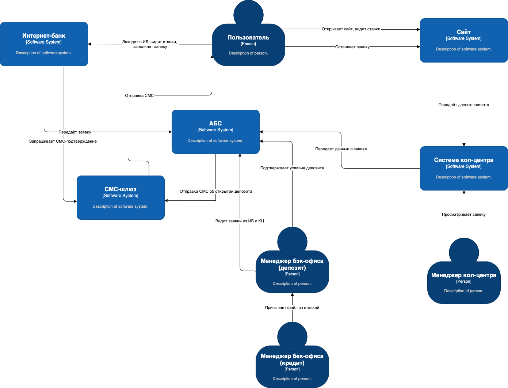
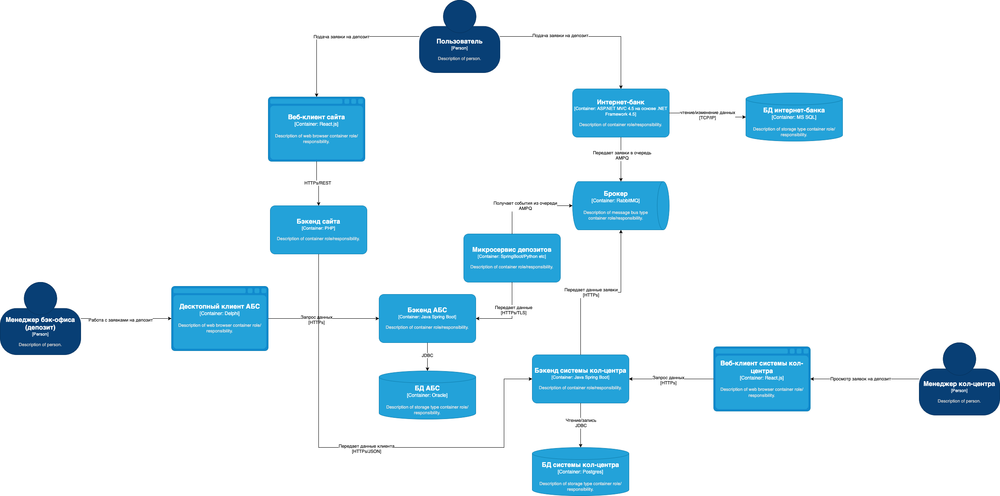

### **Название задачи:** MP-ADR1 MVP системы депозита
### **Автор:** -
### **Дата:** 07/05/2025
### **Функциональные требования**
Опишите здесь верхнеуровневые Use Cases. Их нужно оформить в виде таблицы с пошаговым описанием:

| **№** | **Действующие лица или системы**                                                  | **Use Case**                                 | **Описание**                                                                                                                                                                                                                                                                                                                                                                      |
|-------|:----------------------------------------------------------------------------------|:---------------------------------------------|:----------------------------------------------------------------------------------------------------------------------------------------------------------------------------------------------------------------------------------------------------------------------------------------------------------------------------------------------------------------------------------|
| UC1   | Пользователь Сайт Менеджер кол-центра Система кол-центра СМС-шлюз | Подача заявки на депозит через сайт          | 1. Пользователь заходит на сайт 2. Сайт отображает список доступных депозитов с актуальными ставками. 3. Клиент на сайте подает заявку на депозит, оставив свой номер телефона и ФИО. 4. Сайт передает эти данные в систему кол-центра. 5. Менеджер кол-центра связывается с клиентом. 6. Система кол-центра передает данные в АБС.                           |
| UC2   | Пользователь Интернет-банк Менеджер бэк-офиса АБС СМС-шлюз        | Подача заявки на депозит через интернет-банк | 1. В интернет-банке клиент видит список доступных депозитов с актуальными ставками и персонализированные ставки лично для него. 2.Указав счёт и сумму депозита, он может подать заявку на открытие депозита. 3. Клиент подтверждает операцию с помощью СМС-кода. 4. Менеджер бек-офиса обрабатывает заявку 5. Клиент получает СМС-уведомление об обработки заявки |
| UC3   | Менеджер бэк-офиса АБС                                                        | Работа с заявками и файлами в АБС            | 1. Менеджер бэк-офиса депозитов видит в АБС заявки из кол-центра и из интернет-банка 2. Менеджер бек-офиса депозитов получает из кредитного отдела файл с информацией о ставке. 3. Менеджер подтверждает условия депозита в АБС банка.                                                                                                                                    |

### **Нефункциональные требования**
Опишите здесь нефункциональные требования и архитектурно-значимые требования.

| Код     | Требование                                                                                                                              | 
|---------|-----------------------------------------------------------------------------------------------------------------------------------------|
| R       | ### Надёжность (Reliability)                                                                                                            |             
| **R1**  | **Все сервисы должны работать 24/7 и быть доступны в 99,9% случаев**                                                                    |             
| **R2**  | **В случае сбоев в ЦОД необходимо, чтобы сервисы интернет-банка были доступны и выдерживали требуемую нагрузку**                        |             
| P       | ### Производительность (Performance)                                                                                                    |             
| **P1**  | **Отклик по всем операциям должен быть максимально быстрым и занимать миллисекунды**                                                    |            
| **P2**  | **Предусмотреть равномерное горизонтальное масштабирование и распределение запросов между серверами, приложениями и ЦОД**               |             
| +R      | ### + Ограничения (Restricitions)                                                                                                       |             
| +R1     | Базы данных MS SQL и Oracle                                                                                                             |             
| +R2     | Новые технологии должны быть совместимы с существующими платформами разработки                                                          |             
| +R3     | Если нужны очереди сообщений, то лучше использовать Kafka, но учитывать, что текущая версия платформы интернет-банка несовместима с ней |             
| **+R5** | **Возможен перевод интернет-банка на микросервисную архитектуру, но пока только в рамках задачи открытия депозитов**                    |             
| **+R7** | **Лучше избежать прямой работы интернет-банка с API АБС в новом процессе**                                                              |             
| **+R8** | **АБС может масштабироваться только вертикально из-за своей базы данных**                                                               |             
| +R9     | Интернет-банк работает на ASP.NET MVC 4.5 на основе .NET Framework 4.5 и СУБД MS SQL                                                    |             
| +R10    | АБС - на Delphi и СУБД на Oracle                                                                                                        |             
| +R11    | Система кол-центра - веб-интерфейс на React.js, бэкенд на Java Spring Boot и базы PostgreSQL                                            |             
| +R12    | Сайт на PHP и React.js                                                                                                                  |             
| +S      | ### + Безопасность (Security)                                                                                                           |             
| +S1     | Данные, передаваемые с сайта, необходимо защищать с помощью механизма шифрования трафика                                                |             
| +S2     | Данные, передаваемые в интернет-банке, нужно защитить механизмом шифрования                                                             |             

### **Решение**
Диаграмма контекста: https://drive.google.com/file/d/11y_2FJQaYpieKp-RT6tySg8920eFVElz/view?usp=sharing  

Диаграмма контейнеров: https://drive.google.com/file/d/12aKqG8tFkgfaZjTVifF5187e8TIhcoGT/view?usp=sharing  

Были приняты решения:
1. **Создать отдельный микросервис обработки заявок на депозит**, чтобы:
   - Обособить логику бизнес-процесса (от подачи до обработки),
   - Обеспечить независимое масштабирование (**P2**),
   - Начать поэтапный переход интернет-банка к микросервисной архитектуре (**+R5**),
   - Снизить связанность между фронтами и АБС (**+R7**).

2. **Использовать брокер сообщений RabbitMQ** для взаимодействия:
   - Между системой кол-центра и АБС,
   - Между микросервисом заявок и АБС,
   - Между интернет-банком и микросервисом заявок.

   Это обеспечивает:
   - Асинхронность и отказоустойчивость (**R1**, **R2**),
   - Возможность горизонтального масштабирования обработчиков (**P2**),
   - Устранение прямых вызовов API АБС (**+R7**).

---

### Аргументы в пользу решения

- **Надёжность и отказоустойчивость**: за счёт асинхронного взаимодействия с помощью очередей (**R1**, **R2**).
- **Изоляция АБС**: отсутствие прямых вызовов АБС из фронтов и интернет-банка (**+R7**).
- **Масштабируемость архитектуры**: шаг к микросервисному подходу без кардинального рефакторинга всего интернет-банка (**+R5**).
- **Безопасность**: HTTPS при передаче данных с фронтов (**+S1**, **+S2**).

---

### Альтернативы

1. **Использовать Kafka вместо RabbitMQ**  
   Отклонено: Kafka несовместима с текущей версией интернет-банка (**+R3**).

2. **Передавать данные напрямую из интернет-банка и сайта в АБС**  
   Отклонено: нарушает требование об изоляции АБС (**+R7**).

3. **Встроить обработку заявок прямо в интернет-банк и систему колл-центра**  
   Отклонено: нарушает принцип единой ответственности, усложняет поддержку и масштабирование, мешает микросервисной архитектуре (**+R5**, **S1**).

4. **Делать синхронные вызовы API АБС из всех систем**  
   Отклонено: АБС слабо масштабируется (**+R8**), прямые вызовы увеличивают связанность и создают риски для SLA (**R1**, **R2**).

