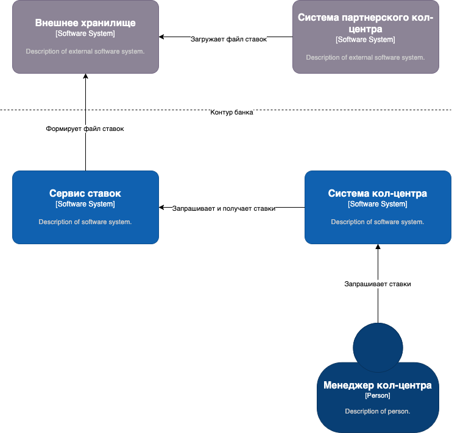
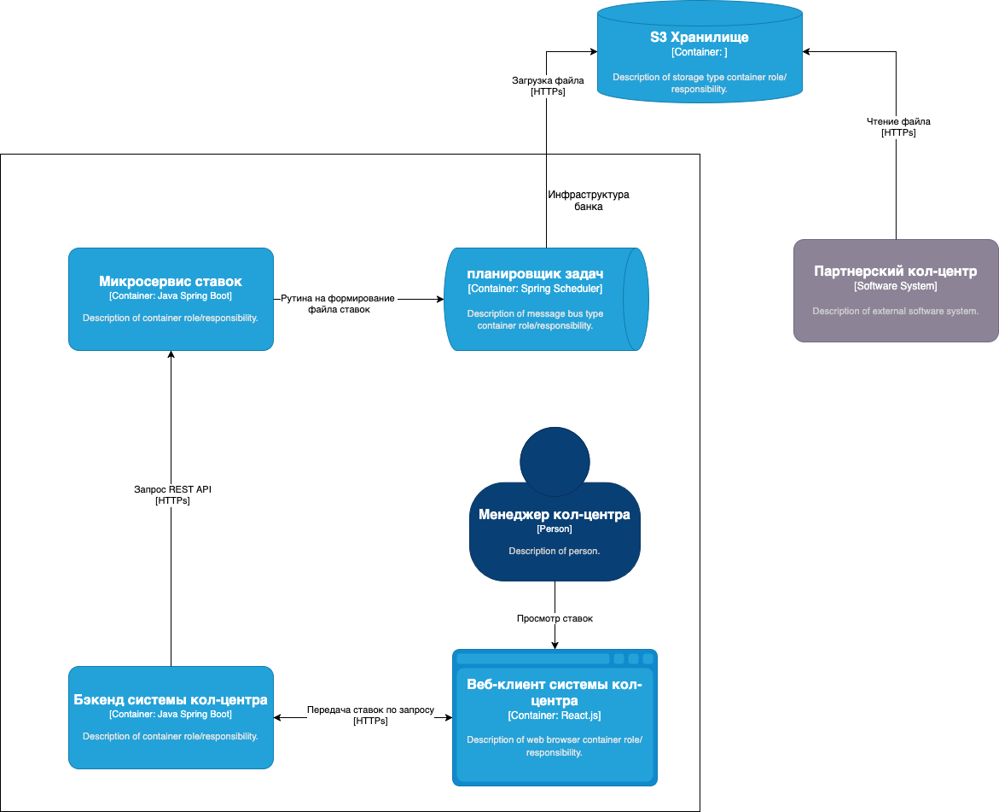
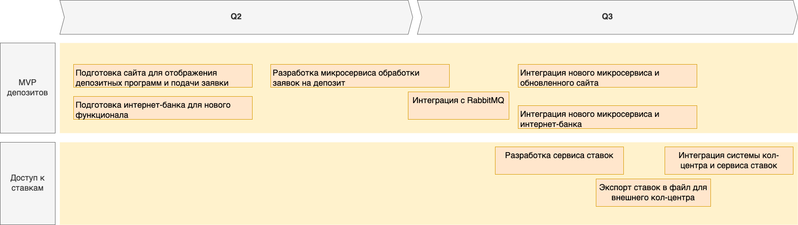

### Название задачи: MP-ADR2 Доступ к ставкам для кол-центра и внешнего партнёрского кол-центра

### Автор: -

### Дата: 08/05/2025

---

## Функциональные требования (Use Cases)

| №   | Действующие лица или системы                            | Use Case                                | Описание                                                                                                                                                                                |
| --- | ------------------------------------------------------- | --------------------------------------- | --------------------------------------------------------------------------------------------------------------------------------------------------------------------------------------- |
| UC4 | Сотрудник кол-центра, система кол-центра, сервис ставок | Просмотр ставок                         | Сотрудник кол-центра в своей системе запрашивает актуальные ставки. Система обращается к сервису ставок банка, получает список доступных депозитов и отображает его оператору.          |
| UC5 | Банк, внешний партнёрский кол-центр                     | Передача ставок партнёрскому кол-центру | Сервис ставок банка регулярно (например, раз в 10 минут) формирует XLS-файл с актуальными депозитными ставками и публикует его в безопасное файловое хранилище, доступное партнёру. |

---

## Нефункциональные требования

| Код | Требование                                                                         |
| --- | ---------------------------------------------------------------------------------- |
| R   | Надёжность                                                                         |
| R1  | Все сервисы должны работать 24/7 и быть доступны в 99,9% случаев                   |
| P   | Производительность                                                                 |
| P1  | Ответ на запрос ставок от системы кол-центра должен приходить за миллисекунды      |
| P2  | Не должно быть перегрузки основного сервиса ставок при большом количестве запросов |
| +R  | Ограничения                                                                        |
| +R1 | Партнёрский кол-центр не может обращаться к API, только получать файлы             |
| +R2 | Необходимо использовать существующие технологии                                    |

---

## Решение

1. Создаётся сервис ставок.
2. Система кол-центра будет обращаться к REST API сервиса ставок через HTTPS. Доступ ограничен внутренней сетью банка.
3. Для внешнего партнёрского кол-центра сервис ставок будет периодически формировать файл XLSX с актуальными ставками и размещать его 
в защищённой директории (например, в облачном хранилище с доступом по ссылке и токену или с VPN). Формирование файла будет реализовано рутиной в 
планировщике задач Spring Scheduler

### Диаграмма контекста:

### Диаграмма компонентов:

---

## Альтернативы

1. **Выдавать доступ к API внешнему партнёру.**

   * Недопустимо из-за ограничений (нет поддержки SFTP, невозможность прямого вызова API).
2. **Ручная рассылка ставок.**

   * Неудобно, риск устаревания информации.

---

## Список задач и Roadmap:

